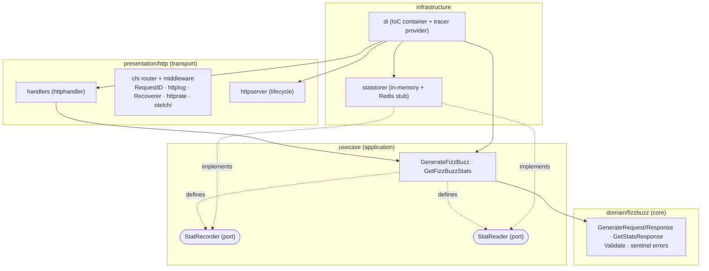

# 0001. Clean / Hexagonal Architecture

- **Status:** Accepted
- **Date:** 2026-06-23

## Context

The fizz-buzz API must be production-ready and maintainable. The team follows a layered,
dependency-rule-enforced architecture (mirrors the in-house reezoback convention), and a clear
structural boundary is needed so that domain logic, application orchestration, transport, and
infrastructure can each be changed independently.

## Decision

Adopt a clean/hexagonal architecture with the dependency rule
`presentation → usecase → domain`; `infrastructure` sits outside the ring and implements the
ports defined by the application layer. The DI container wires every piece together.



The dependency rule flows inward: presentation depends on application, application depends on
domain, and domain depends on nothing; infrastructure implements the application's ports and is
wired at startup by the DI container, so no inner layer ever imports an outer one.

### Package layout

```
domain/fizzbuzz/         # package fizzbuzz — named after the business concept
  model.go               # GenerateRequest, GenerateResponse, GetStatsResponse (data only)
  error.go               # sentinel errors: ErrFailedToValidateGenerateRequest, ErrNoStatsRecorded
  validator.go           # func (r GenerateRequest) Validate(maxLimit int) error

usecase/
  generate_fizzbuzz.go   # defines StatRecorder port; Execute(ctx, req) — validate → generate → record
  get_fizzbuzz_stats.go  # defines StatReader port; Execute(ctx)

presentation/http/
  handler/               # package httphandler — thin handlers: parse → usecase → JSON
  server/                # package httpserver — Server lifecycle: Start/Stop, timeouts, BaseContext, ErrorLog

infrastructure/
  di/                    # IoC container (lazy getters) + tracer provider (tracing.go)
  statstorer/            # in_memory.go + redis.go (placeholder)

config/config.go         # sethvargo/go-envconfig, grouped sub-structs
cmd/main.go              # entrypoint — config → DI → Start → signal → Stop
```

### Naming conventions

- Domain types are named after business concepts, not use-cases (`fizzbuzz.GenerateRequest`, not
  `fizzbuzz.GenerateFizzBuzzRequest`).
- The generation logic lives in the use-case `Execute`, not on the domain type (domain = data +
  validation only). See [0004](0004-domain-model-validation-generation.md).
- Ports (`StatRecorder`, `StatReader`) are defined where they are *consumed* (use-case package),
  implemented in infrastructure — classic dependency inversion.

## Consequences

- Each layer is independently unit-testable with fakes/stubs at the port boundary.
- Adding a new transport (gRPC, CLI) or swapping the stat store (Redis) requires no changes to
  the domain or use-cases.
- The layering adds files but keeps each unit small, single-purpose, and easy to navigate.
- The domain depends on nothing, making it trivially portable and fast to test.
