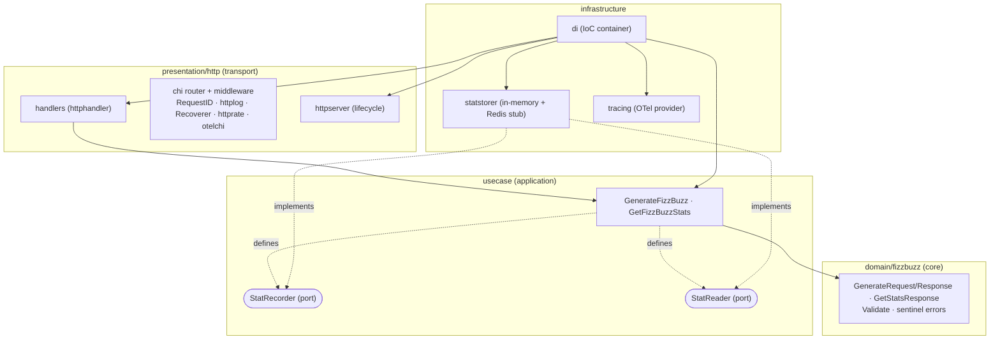

# Developer guide

Engineering reference for the fizz-buzz API: architecture, the production-ready
principles it follows, project layout, and the local/CI workflow. Every decision
has a dedicated record under
[Architecture Decision Records](architecture-decision-records/README.md).

## Architecture — clean / hexagonal



**Dependency rule:** `presentation → application → domain`. The **domain** depends
on nothing. The **use-cases** define the ports (`StatRecorder`, `StatReader`)
they need; **infrastructure** implements them. The **DI container** is the only
place that knows concrete types and wires everything together. See
[ADR 0001](architecture-decision-records/0001-clean-hexagonal-architecture.md).

## Project layout

```
cmd/                         # entrypoint: config -> container -> serve -> graceful shutdown
config/                      # env-var configuration (go-envconfig), grouped by concern
domain/fizzbuzz/             # value objects, validation, sentinel errors (no I/O, no deps up)
usecase/                     # application logic; defines StatRecorder/StatReader ports
infrastructure/
  statstorer/                # in-memory stat store (+ Redis placeholder)
  di/                        # IoC container: lazy getters, HTTP server, tracer provider
presentation/http/
  handler/  (httphandler)    # query parsing, handlers, JSON responses
  middleware/ (httpmiddleware) # the bits chi doesn't provide
  server/   (httpserver)     # http.Server lifecycle (Start/Stop)
docs/                        # this guide + ADRs
```

## Production-ready principles

**12-factor.** Config strictly from the environment (required vars have no
defaults — [ADR 0009](architecture-decision-records/0009-configuration-and-lifecycle.md));
logs are a JSON event stream to stdout, never files
([ADR 0017](architecture-decision-records/0017-metrics-delegated-to-infra.md));
the process is stateless and disposable (fast startup, graceful shutdown on
`SIGINT`/`SIGTERM`); dev/prod parity via the distroless image
([ADR 0019](architecture-decision-records/0019-container-and-ci-cd.md)).

**SOLID.**
- *Single responsibility* — one concern per package/file (domain data vs
  validation vs use-case orchestration vs transport).
- *Open/closed & Liskov* — new stat backends or rate-limit counters plug in
  behind interfaces without touching callers (in-memory today, Redis stub ready).
- *Interface segregation* — the write side (`StatRecorder`) and read side
  (`StatReader`) are separate ports, each defined where it is consumed
  ([ADR 0006](architecture-decision-records/0006-statistics-store.md)).
- *Dependency inversion* — use-cases depend on ports they declare; the DI
  container injects concrete implementations.

**Law of Demeter.** Layers talk only to their immediate neighbour: handlers
invoke a use-case, the use-case talks to its ports — a handler never reaches
into the store or the domain internals. Thin transport, thin handlers.

**Operational endpoints.** Liveness (`/healthz`) and readiness (`/readyz`) are
distinct ([ADR 0008](architecture-decision-records/0008-operational-endpoints-health-readiness.md)):
liveness = the process is up; readiness = ready to serve (would gate on external
dependencies once any exist).

**Lifecycle.** A single base context backs the server's `BaseContext` and is
canceled on exit; shutdown uses a *fresh* `context.Background()` deadline so a
canceled app context can't abort graceful draining.

## Observability

- **Logging** — structured JSON via `go-chi/httplog/v2` (imported as `ctxlog`),
  one line per request (method, path, status, duration, request id). Handlers and
  use-cases enrich the request-scoped entry (`http_handler`, `use_case`) so all
  lines of a request are correlated
  ([ADR 0015](architecture-decision-records/0015-request-logging-httplog.md)).
- **Tracing** — OpenTelemetry, opt-in via `TRACING_ENABLED`; server span from
  `otelchi`, use-case spans for the intra-request breakdown; OTLP/HTTP export; the
  tracer provider is owned by the DI container and flushed on shutdown
  ([ADR 0018](architecture-decision-records/0018-distributed-tracing-opentelemetry.md)).
- **Metrics** — HTTP golden signals are **not** instrumented in-app; they are
  delegated to the infrastructure layer (mesh / ingress / LB / eBPF)
  ([ADR 0017](architecture-decision-records/0017-metrics-delegated-to-infra.md)).

## Local development

Prerequisites: Go 1.26+, `golangci-lint` v2, (optional) Docker.

```sh
make build   # go build ./...
make test    # go test ./...
make race    # go test -race ./...
make lint    # golangci-lint run
make run     # go run ./cmd  (provide the required env vars)
```

The linter is strict (golangci-lint v2, `disable-all` + a curated set — see
`.golangci.yaml` and [ADR 0012](architecture-decision-records/0012-linting-golangci-lint.md)).
Run `golangci-lint run --fix` to auto-apply formatter/whitespace fixes.

**Testing strategy** — pure unit tests on the domain (generation edge cases,
validation, wrapped sentinels via `errors.Is`); use-case tests with fakes;
concurrency test on the store under `-race`; handler/integration tests via
`httptest` (status codes, response shapes, stats semantics). Black-box `_test`
packages; `t.Parallel()` where applicable.

## CI/CD

GitHub Actions ([`.github/workflows/ci.yml`](../.github/workflows/ci.yml)):
- **lint** — golangci-lint v2.
- **test** — `go build`, `go vet`, `go test -race` with coverage.
- **docker** — multi-arch build of the distroless image, pushed to GHCR on
  `master`/tags (PRs build only).

Dependencies are kept current by Dependabot (gomod, docker, github-actions). See
[ADR 0019](architecture-decision-records/0019-container-and-ci-cd.md).
